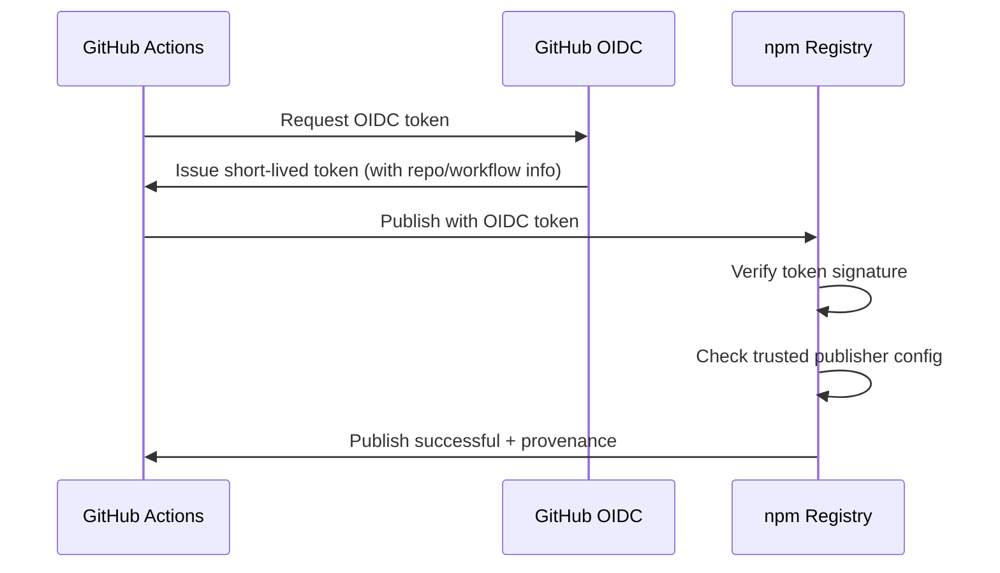

# OIDC Trusted Publishing Setup for Arkae

**OIDC (OpenID Connect)** allows GitHub Actions to publish to npm without managing tokens.

## Benefits

✅ **No tokens to manage** - No secrets, no rotation, no expiration  
✅ **More secure** - Nothing to leak or steal  
✅ **No 2FA bypass needed** - Direct authentication  
✅ **Automatic provenance** - Cryptographic proof of package origin  
✅ **Better audit trail** - Clear publishing history  

---

## Setup Steps

### Prerequisites
- ✅ npm account created
- ✅ `@arkae` organization created on npm
- ✅ Maintainer access to the organization

### Step 1: Configure OIDC on npm (One-time setup)

1. **Go to npm organization settings:**
   https://www.npmjs.com/settings/arkae/oidc

2. **Add GitHub as trusted publisher:**
   - Click "Add Publishing Provider"
   - Select: **GitHub Actions**
   
3. **Configure the connection:**
   ```
   Repository: lizbrenner/arkae
   Workflow: release.yml
   Environment: (leave blank for any environment)
   ```

4. **Set permissions:**
   - Select: All packages in organization
   - Or specify individual packages: `@arkae/library`, `@arkae/primitives`, etc.

5. **Save configuration**

### Step 2: Update Package Settings (per package)

For each package you want to publish via OIDC:

1. Go to: https://www.npmjs.com/package/@arkae/library/access
2. Enable: **"Require publish from CI/CD"**
3. This ensures packages can only be published via OIDC (prevents manual token publishing)

### Step 3: Remove NPM_TOKEN from GitHub (Optional after OIDC works)

Once OIDC is working:
1. Go to: https://github.com/lizbrenner/arkae/settings/secrets/actions
2. Delete `NPM_TOKEN` secret (no longer needed!)

### Step 4: Test Publishing

Your GitHub Actions workflow is already configured for OIDC (`id-token: write` permission).

**To test:**

```bash
# Create a changeset
pnpm changeset

# Commit and push
git add .
git commit -m "test: OIDC publishing"
git push
```

GitHub Actions will:
1. Request a short-lived token from npm via OIDC
2. Authenticate automatically
3. Publish packages with provenance attestation

---

## How It Works



**Key Points:**
- Token is issued per workflow run
- Expires after the workflow completes
- Contains claims about the repository and workflow
- npm verifies the token signature and trusted configuration

---

## Verification

After your first OIDC publish, verify it worked:

### Check Provenance

Visit your package page:
```
https://www.npmjs.com/package/@arkae/library
```

Look for:
- ✅ **Provenance badge** - Shows the package was published via OIDC
- 🔍 **Build details** - Links to exact GitHub Actions run
- 🔐 **Cryptographic attestation** - Proof of origin

### View Publishing History

```bash
npm view @arkae/library
```

Should show:
- Published via GitHub Actions
- OIDC provenance attestation
- Links to source repository

---

## Troubleshooting

### "403 Forbidden" or "OIDC not configured"

**Cause:** npm OIDC settings not configured

**Fix:**
1. Go to https://www.npmjs.com/settings/arkae/oidc
2. Ensure GitHub Actions is added as trusted publisher
3. Verify repository name is correct: `lizbrenner/arkae`
4. Check workflow name matches: `release.yml`

### "id-token permission not granted"

**Cause:** Workflow missing OIDC permission

**Fix:**
Already configured in `.github/workflows/release.yml`:
```yaml
permissions:
  id-token: write  # ✅ Required for OIDC
```

### Workflow still using NPM_TOKEN

**During transition:** The workflow can use NPM_TOKEN as fallback while you set up OIDC.

**After OIDC is working:** Remove these lines from workflow:
```yaml
NODE_AUTH_TOKEN: ${{ secrets.NPM_TOKEN }}  # Remove this
```

And delete the GitHub secret.

---

## Migration Path

### Phase 1: Setup (you are here)
1. Configure OIDC on npm organization
2. Test publish with OIDC
3. Verify provenance appears

### Phase 2: Transition
1. Keep NPM_TOKEN as backup
2. Monitor first few OIDC publishes
3. Ensure everything works

### Phase 3: Complete
1. Remove NPM_TOKEN from GitHub secrets
2. Revoke any npm tokens
3. Fully OIDC-based publishing ✅

---

## Package-specific OIDC Settings

You can configure OIDC per package or for the whole organization:

### Organization-wide (Recommended)
- Applies to all `@arkae/*` packages
- Configured at: https://www.npmjs.com/settings/arkae/oidc

### Per-package
- Individual package settings
- Useful if you want different workflows for different packages
- Configured at: https://www.npmjs.com/package/@arkae/library/access

---

## Security Benefits

### With Traditional Tokens
- ❌ Token stored in GitHub Secrets (attack surface)
- ❌ Manual rotation every 90 days
- ❌ Can leak if secrets are exposed
- ❌ Requires 2FA bypass for automation

### With OIDC
- ✅ No stored secrets
- ✅ No rotation needed
- ✅ Token exists only during workflow run
- ✅ Cryptographic proof of origin (provenance)
- ✅ Can't publish manually (prevents social engineering)
- ✅ Audit trail shows exact GitHub commit/workflow

---

## Additional Resources

- [npm OIDC Documentation](https://docs.npmjs.com/generating-provenance-statements)
- [GitHub OIDC Documentation](https://docs.github.com/en/actions/deployment/security-hardening-your-deployments/about-security-hardening-with-openid-connect)
- [npm Provenance](https://github.blog/2023-04-19-introducing-npm-package-provenance/)

---

## Next Steps

1. ✅ Go to https://www.npmjs.com/settings/arkae/oidc
2. ✅ Add GitHub Actions as trusted publisher
3. ✅ Configure for repository: `lizbrenner/arkae`
4. ✅ Test with: `pnpm changeset` → commit → push
5. ✅ Verify provenance on published packages
6. ✅ (Optional) Remove NPM_TOKEN secret after successful test

**Your GitHub Actions workflow is already OIDC-ready!** Just configure npm's side and you're done.
